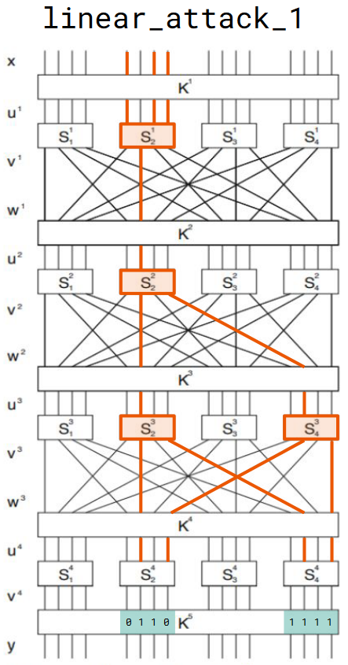
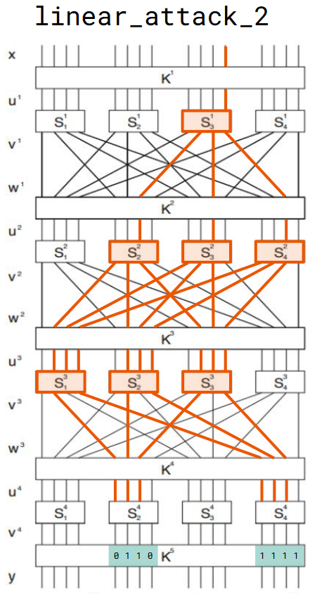
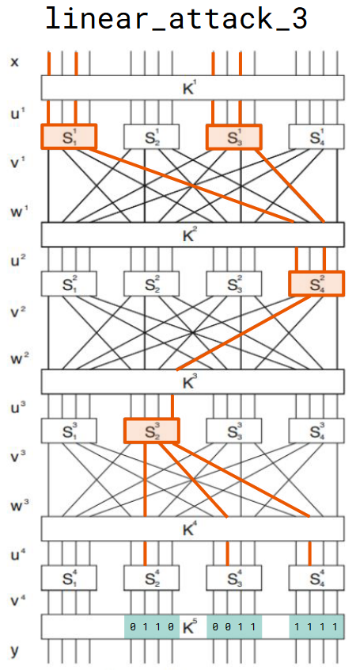
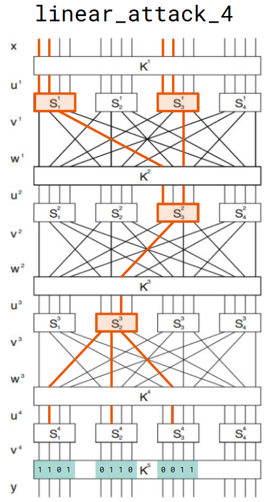
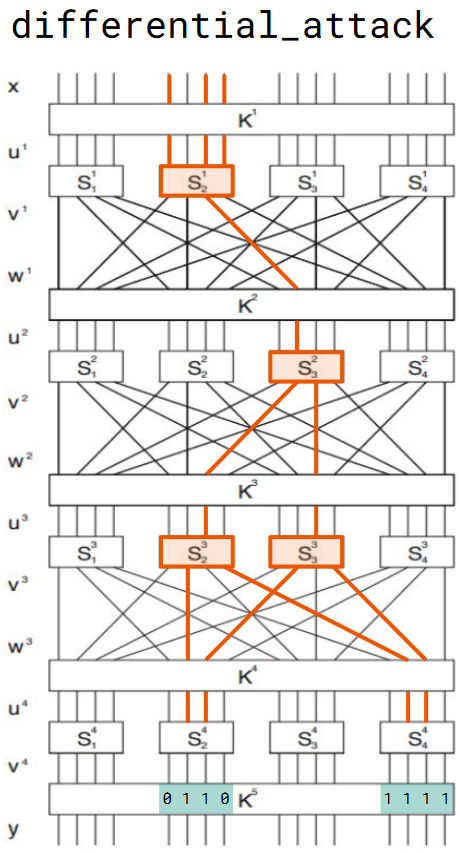
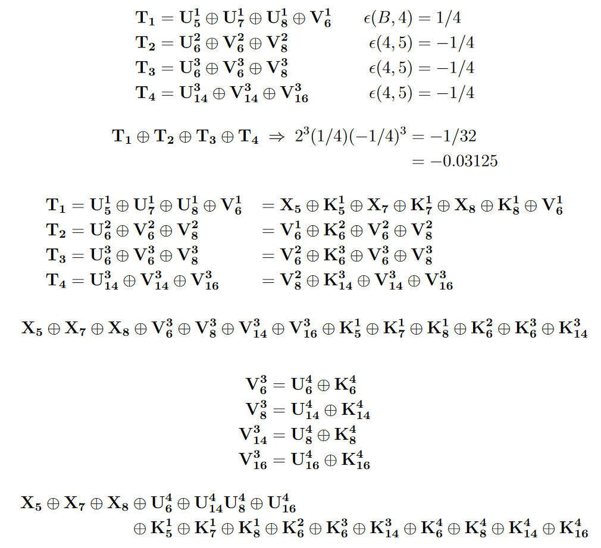
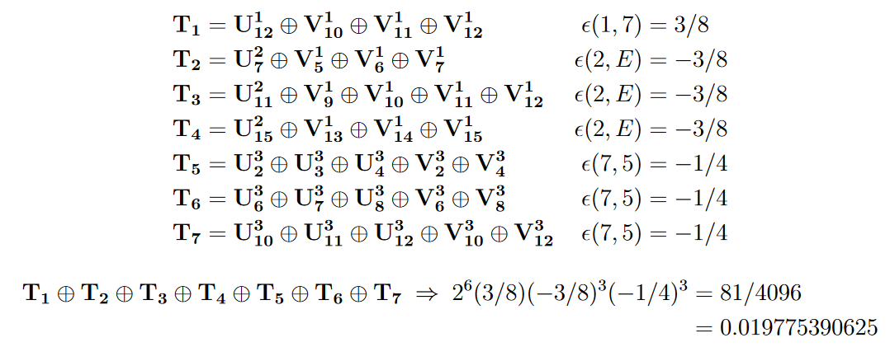
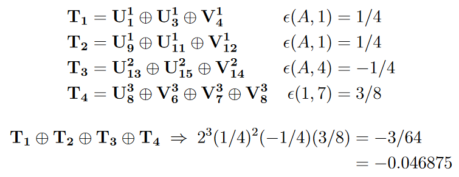
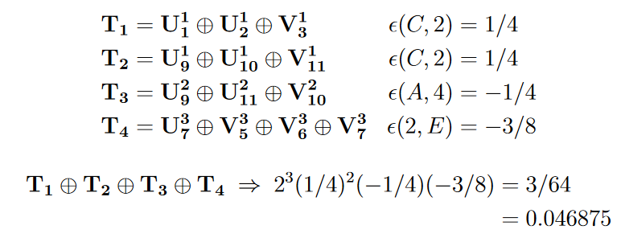

# spn-attack

[ToC]

## Aufgabenstellung

> anbei der Literaturabschnitt aus
> 
> [Stinson, Paterson: Cryptography, 4. Auflage](#quelle)
> 
> Beschrieben werden zwei Methoden:
> die Lineare und die Differentielle Kryptoanalyse;
> 
> beide könnten im Projekt ausprobiert werden und insbesondere auch die 
> Zahlen T für die benötigten Klartext-Geheimtextpaare auf Seite 98 bzw. 
> Seite 105 oben validiert werden.
> 
> Schön wäre, wenn etwas Bleibendes - z.B. schöne Visualisierung - 
> entsteht, das in den nächsten Semestern im Seminar eingesetzt werden kann.
> 
> https://speicherwolke.uni-leipzig.de/index.php/s/6aYFmQxoRoigrER/download

## Verwendung

Dieses Projekt enthält vier Skripte, welche alle separat ausgeführt werden können, solange sie sich im gleichen Ordner befinden. Für die Ausführung der Skripte muss eine `python`-Umgebung installiert sein, welche die Packete `numpy`, `colorama`, `time` und `random` enthält.

Zum Testen der Linearen Angriff muss die Datei [`Linear_Attack.py`](Linear_Attack.py) ausgeführt werden. Durch editieren der Variable `Attack` können einzele Angriffe ausgewählt werden. Bsp.:
- `Attacks = [1]`: Nur der von [Stinson (2018)](#quelle) beschriebene Beispielangriff wird ausgeführt.
- `Attacks = [1,2,3,4]`: Alle implementierten Angriff werden der Reihe nach ausgeführt (Achtung: Die Angriffe 3-4 können längere Laufzeiten haben [ca. 2-3 min je Angriff])

Zum Testen des Differenziellen Angriffs muss die Datei [`Differential_Attack.py`](Differential_Attack.py) ausgeführt werden.

## Skripte

- [`Basic_SPN.py`](Basic_SPN.py)
  - Implementierung grundlegender Funktionen des Substitutions-Permutations-Netzwerks (Schlüsselgenerierung, S-Box, Bit-Permutation und Verschlüsselung)
- [`Linear_Attack.py`](Linear_Attack.py)
  - Implementierung 4 linearer Angriffe (inklusive des Angriffs aus [Stinson (2018)](#quelle))
  - Berechnung von $N_L(a,b)$ sowie der linearen Approximationstabelle
  - Invertierung der S-Box
- [`Differential_Attack.py`](Differential_Attack.py)
  - Implemenierung des diffenenziellen Angriffs aus [Stinson (2018)](#quelle)
  - Berechnung der Menge $\Delta(x')$ bestehend aus den geordneten Paaren $(x,x^*)$ wobei $x'=x\oplus x^*$
  - Berechnung von $N_D(a',b')$ sowie der Differenz-Verteilungstabelle
- [`Console_Outputs.py`](Console_Outputs.py)
  - Funktionen zur Formatierung der Ausgaben in der Konsole

## Ergebnisse

Die beiden Beispiele für den linearen sowie den differenziellen Angriff konnten anhand der Beschreibung von [Stinson (2018)](#quelle) implementiert werden. Zusätzlich wurde 3 eigene Lineare Angriffe implementiert.

### Validierung der Werte für $T$

Die im Buch verwendeten Zahlen für $T$ (Anzahl benötigter Klartext-Geheimtextpaare) konnte für für beide Attacken bestätigt werden:
- $T=8000$ für den Linearen Angriff
- $T_{right\,pairs}=50$ bis $100$ für den Differenziellen Angriff (bei unseren Versuchen haben wir den Eindruck bekommen, dass Werte zwischen $40$ und $80$ ausreichen)

Mit $T_{right\,pairs}$ bezeichnen wir eine Teilmenge aller verwendeten Klartext-Geheimtextpaare, die als "richtigen" Paare für den Differenziellen Angriff gelten. Diese Bedingung ist im vorliegenden Fall erfüllt, falls $y_{<1>}=(y_{<1>})^*$ und $y_{<3>}=(y_{<3>})^*$ (vlg. [Stinson (2018), S.104](#quelle)). Im Buch wird diese Teilmenge nicht explizit benannt. Bei unserer Implementierung werden die Paare von $T$ zufällig erzeugt und gewählt, wodurch wir im Code $T$ Werte zwischen $4000$ und $8000$ verwendet haben. Nach dem Filtern, bleiben so genug "richtige" Paare übrigen, da sie einen ungefähren Anteil von 0.95-1% an allen Klartext-Geheimtextpaaren zu haben scheinen (nicht bewiesen, nur beobachtet).

### Schätzung von $T$

Die Zahlen für $T$ bei den 3 weiteren Angriffen (`linear_attack_2`, `linear_attack_3` und `linear_attack_4`) entprachen den durch die Schätzfunktion $T\approx c\epsilon^{-2}$ Werten, wobei die Konstante $c$ zwischen $6$ und $8$ lag (nahe an dem im Buch gegebenen Wert von $c\approx 8$ für den Beispielangriff `linear_attack_1`).

## Quelle
Stinson, D.R.; Paterson, M.B.: Cryptography - Theory and Practice, CRC Press 2018

## Bilder
### Graphische Darstellungen der implementierten Angriffe

### Berechnung des Bias $\epsilon$ für die Linearen Angriffe

- `linear_attack_1`
  

- `linear_attack_2`
  

- `linear_attack_3`
  

- `linear_attack_4`
  
