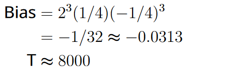

# spn-attack

Projektmitglieder: Ayesha Shabbir und Leonard König

Dieses Projekt implementiert zwei Methoden zur Kryptoanalyse eines Substitutions-Permutations-Netzwerks (SPN) anhand der Beschreibungen von [Stinson u. a. (2018)](#quelle). 

# Verwendung

Dieses Projekt enthält vier Skripte, welche alle separat ausgeführt werden können, solange sie sich im gleichen Ordner befinden. Für die Ausführung der Skripte muss eine `python`-Umgebung installiert sein, welche die Packete `numpy`, `colorama`, `time` und `random` enthält.

Zum Testen der linearen Angriffe muss die Datei [`Linear_Attack.py`](scripts/Linear_Attack.py) ausgeführt werden. Durch editieren der Variable `Attack` können einzele Angriffe ausgewählt werden. Bsp.:
- `Attacks = [1]`: Nur der von [Stinson u. a. (2018)](#quelle) beschriebene Beispielangriff wird ausgeführt.
- `Attacks = [1,2,3,4]`: Alle implementierten Angriff werden der Reihe nach ausgeführt (Achtung: Die Angriffe 3-4 können längere Laufzeiten haben [ca. 2-3 min je Angriff])

Zum Testen des differenziellen Angriffs muss die Datei [`Differential_Attack.py`](scripts/Differential_Attack.py) ausgeführt werden.

# Skripte

- [`Basic_SPN.py`](scripts/Basic_SPN.py)
  - Implementierung grundlegender Funktionen des Substitutions-Permutations-Netzwerks (Schlüsselgenerierung, S-Box, Bit-Permutation und Verschlüsselung)
- [`Linear_Attack.py`](scripts/Linear_Attack.py)
  - Implementierung 4 linearer Angriffe
  - Berechnung von $`N_L(a,b)`$ sowie der linearen Approximationstabelle
  - Invertierung der S-Box
- [`Differential_Attack.py`](scripts/Differential_Attack.py)
  - Implemenierung des diffenenziellen Angriffs
  - Berechnung der Menge $`\Delta(x')`$ bestehend aus den geordneten Paaren $`(x,x^*)`$ wobei $`x'=x\oplus x^*`$
  - Berechnung von $`N_D(a',b')`$ sowie der Differenz-Verteilungstabelle
  - Berechnung von $`R_p(a',b')`$ (nur für 4-Bit Zahlen)
- [`Console_Outputs.py`](scripts/Console_Outputs.py)
  - Funktionen zur Formatierung der Ausgaben in der Konsole

# Übersichten der implementierten Angriffe

- `linear_attack_1`
  
  

  

- `linear_attack_2`
  
  

  

- `linear_attack_3`
  
  

  

- `linear_attack_4`
  
  

  

- `differencial_attack`

  

# Quelle

Stinson, D.R.; Paterson, M.B.: Cryptography - Theory and Practice, CRC Press 2018
